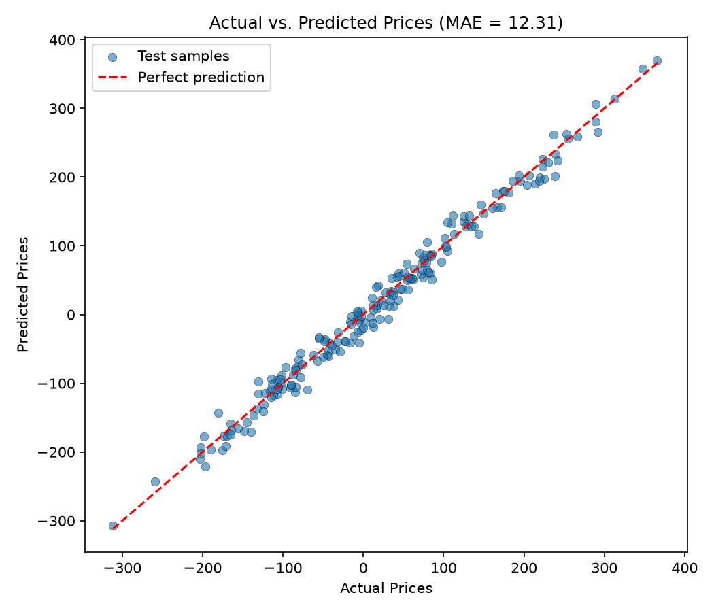

# The Dynamic Pricing Engine (Regression)

**Name:** Janhavi Sharma
**Email:** janhavis1006@gmail.com

## Problem Statement

Predict continuous price points based on market variables. Using synthetic data from
`make_regression(n_samples=1000, n_features=3, noise=15, random_state=42)`:

- `X` holds three features: `Competitor_Price`, `Inventory_Level` and `Demand_Score`.
- `y` is the target: the optimal `Sale_Price`.

Deliverable: train a regression model, print the Mean Absolute Error (MAE), and plot
"Actual Prices" against the model's "Predicted Prices" in a scatter plot.

## Approach

1. Generate the dataset with the setup code provided and name the three feature columns.
2. Split the data 80/20 into train and test sets (`random_state=42`) so the MAE reflects unseen data.
3. Train a `LinearRegression` model. The data is generated from a linear relationship plus
   Gaussian noise, so a linear model is a natural fit and its coefficients are easy to interpret.
4. Predict on the test set and compute the MAE with `sklearn.metrics.mean_absolute_error`.
5. Draw a scatter plot of actual against predicted prices, with a red dashed `y = x` line
   showing perfect prediction. Points close to the line mean accurate predictions.

## Setup and Run

Requires Python 3.9+.

```bash
git clone https://github.com/JanhaviK30/mentroid-ml-task11-the-dynamic-pricing-engine-regression-Janhavi.git
cd mentroid-ml-task11-the-dynamic-pricing-engine-regression-Janhavi
pip install -r requirements.txt
python pricing_engine.py
```

The script prints the MAE and the learned coefficients, and saves the plot as
`actual_vs_predicted.png`.

## Results

| Metric | Value |
|---|---|
| Mean Absolute Error (test set) | **12.3070** |

Learned coefficients:

| Feature | Coefficient |
|---|---|
| Competitor_Price | 98.4572 |
| Inventory_Level | 83.4574 |
| Demand_Score | 25.7796 |

The MAE is consistent with the noise level of 15 added to the data (for Gaussian noise with
standard deviation 15, the expected absolute error is about 12), so the model is capturing
essentially all of the learnable signal. Competitor price is the strongest driver of sale price.



## Files

- `pricing_engine.py` - training, evaluation and plotting script
- `actual_vs_predicted.png` - scatter plot of actual vs predicted prices
- `requirements.txt` - Python dependencies
